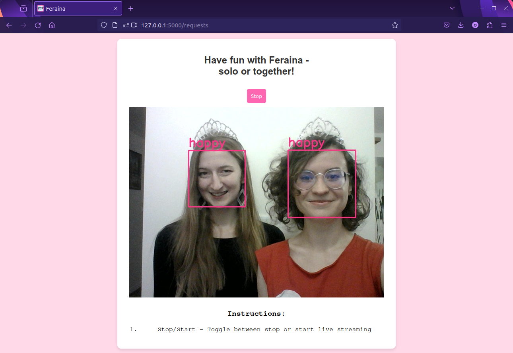

# facial-emotion-recogniton

A code repository for Bachelor's thesis project titled "_Emotion detection from face images using machine learning methods_"

Recognizing facial emotions from images, covering dataset preparation, model training, and a demo web app for real-time inference.

## Contents

- `dataset_prep/` – scripts for preparing and preprocessing facial emotion datasets (e.g. AffectNet, ExpW), including face cropping and train/test splitting.
- `models/` – emotion recognition model implementations used in the project (DAN, DMUE, POSTER_V2).
- `ran_models/` – training scripts run for specific model/dataset combinations.
- `app_feraina/` – demo application (FastAPI/Flask + ONNX) with a simple web interface for real-time emotion prediction.

## Getting started

Install the app dependencies:

```bash
pip install -r app_feraina/requirements.txt
```

Download the pretrained ONNX model from [here](https://1drv.ms/u/c/e651ca9104cac9d9/EUm603VCMypEhHPWT-gNuq4BdO6dscj-FmE2uRr01BVTwg?e=ZYnT9X) and place it as `app_feraina/server/raf_best.onnx`.

## Running the app

The app requires two processes running at the same time — the inference server and the camera app.

Terminal 1 — start the server:

```bash
cd app_feraina
python server/server.py
```

Terminal 2 — start the camera app:

```bash
cd app_feraina
python app/my_camera_app.py
```

## Demo

<p align="center">
  
  
</p>
